Level 1: Foundations of Test & Engineering Thinking
===================================================

.. image:: .._static/media/image1.png
   :alt: Level 1 student manual cover
   :align: center
   :width: 80%

.. contents:: On this page
   :local:
   :depth: 2

Test in Engineering
===================

Every day, we interact with products that we rarely think twice about.

- You expect your phone to connect to Wi-Fi.

- You expect your car to start when you turn the key.

- You expect your headphones to connect to Bluetooth.

- You expect the elevator to stop at the correct floor.

- You expect your GPS to tell you where you are.

But how do we know these systems will work? The answer is testing!

What is it?
^^^^^^^^^^^

Test in engineering is the process of evaluating the performance,
reliability, safety, and quality of a product before it reaches the
customer.

Engineers design experiments, collect data, and build automated systems
that help answer one of the most important questions in engineering:
"How do we know this works?"

Their goal is to find problems before customers do. Rather than relying
on assumptions, test engineers use measurements and data to verify that
a product behaves as expected.

Hardware vs. Software Test
^^^^^^^^^^^^^^^^^^^^^^^^^^

Testing exists everywhere, but it often looks different depending on
what is being tested.

+------------------------------------+---------------------------------+
| Hardware Testing                   | Software Testing                |
+====================================+=================================+
| Tests physical products            | Tests software and applications |
+------------------------------------+---------------------------------+
| Uses sensors, instruments, code,   | Uses code and test scripts      |
| and test scripts.                  |                                 |
+------------------------------------+---------------------------------+
| Focuses on real-world performance  | Focuses on functionality and    |
| and reliability                    | user experience                 |
+------------------------------------+---------------------------------+
| Example: Medical device            | Example: Mobile app             |
+------------------------------------+---------------------------------+

In our workshops, we are going to be focusing on hardware testing!

Many students imagine engineers spending all day designing new things.

While design is important, a huge part of engineering is asking
questions:

- Does this work?

- How well does it work?

- What happens if it fails?

- How can we improve it?

Testing provides the evidence needed to answer those questions.

Products don't magically appear overnight. Every product follows a
journey from an initial idea to something customers can use in the real
world.

To understand where testing fits into that journey, we first need to
understand the Product Life Cycle.

The Product Life Cycle
======================

.. _what-is-it-1:

What is it?
^^^^^^^^^^^

The Product Life Cycle (PLC) is the journey a product takes from an
initial idea to something that customers use in the real world. From a
business perspective, companies use the PLC to make decisions about
pricing, marketing, and sales strategies. From an engineering
perspective, the PLC helps teams design, build, test, and improve
products while ensuring they meet requirements for performance,
reliability, and safety.

|image2|\ For engineers, the lifecycle typically begins with an idea,
followed by research, design, prototyping, validation, production, and
deployment. At each stage, testing helps reduce risk, uncover problems
early, and build confidence that the final product will work as
intended.

Figure 1. Product Development Life Cycle diagram.

A common misconception is that testing only happens once a product is
finished. Testing occurs throughout the entire product lifecycle.
Engineers test ideas during research, verify design assumptions,
evaluate prototypes, validate performance against requirements, inspect
products during manufacturing, and monitor performance after deployment.

As products move through the lifecycle, the goals of testing evolve.
Early testing focuses on learning and reducing uncertainty, while later
testing focuses on ensuring consistency, quality, and reliability.
Although testing is present at every stage, two phases play a
particularly important role in bringing a product to market:
**Verification &** **Validation** and **Production**.

**Verification & Validation (V&V) answers the question: "Did we design
the product correctly?"**

**Production answers the question: "Did we build the product
correctly?"**

Understanding the difference between these two phases is critical
because together they help ensure that products are both designed to
work and manufactured to work every time.

Verification and Validation (V&V) Testing
-----------------------------------------

.. _what-is-it-2:

What is it?
^^^^^^^^^^^

Before a company invests time and money manufacturing thousands of
units, engineers need confidence that the design will perform as
expected in the real world. V&V testing is performed on prototypes and
early product designs to verify functionality, performance, reliability,
and safety.

V&V testing can take many forms depending on the product and industry:

+-----------------------------------+-----------------------------------+
| Types of tests                    | Questions it answers              |
+===================================+===================================+
| Functional                        | - Does the product do what it was |
|                                   |   designed to do?                 |
|                                   |                                   |
|                                   | - Do all features operate         |
|                                   |   correctly?                      |
+-----------------------------------+-----------------------------------+
| Performance                       | - How well does the product       |
|                                   |   perform?                        |
|                                   |                                   |
|                                   | - Does it meet speed, accuracy,   |
|                                   |   or throughput requirements?     |
+-----------------------------------+-----------------------------------+
| Reliability                       | - Will the product continue to    |
|                                   |   work overtime?                  |
|                                   |                                   |
|                                   | - What happens after thousands or |
|                                   |   millions of cycles?             |
+-----------------------------------+-----------------------------------+
| Environmental                     | - Can the product survive where   |
|                                   |   it will be used?                |
+-----------------------------------+-----------------------------------+
| Stress                            | - What happens when the product   |
|                                   |   is pushed beyond normal         |
|                                   |   operating conditions?           |
+-----------------------------------+-----------------------------------+
| Safety                            | - Does the product operate safely |
|                                   |   for users and the surrounding   |
|                                   |   environment?                    |
+-----------------------------------+-----------------------------------+

V&V Example: Boeing
^^^^^^^^^^^^^^^^^^^

A great example of Verification & Validation (V&V) testing comes from Boeing during the development of commercial aircraft systems. Before an aircraft ever enters service, engineers must verify that each subsystem meets its design requirements and validate that the overall system performs as intended in real-world operating conditions.

To accomplish this, Boeing engineers use automated test systems to
simulate electrical signals, sensor inputs, and operating scenarios that
the aircraft may encounter throughout its lifecycle. These tests help
engineers evaluate system behavior, identify potential issues early in
development, and confirm that safety, reliability, and performance
requirements have been met before the aircraft reaches customers.

|image3|

Figure 2. A quote from one of Boeing’s engineers describing how they ran
their tests.

The key lesson from the Boeing example is that V&V testing goes beyond
answering: "Did we reduce noise?"

Instead, engineers ask:

1. "How well does it work?"

2. "Will it continue working overtime?"

3. "Does it perform consistently?"

4. "Can we trust it in a real-world application?"

Verification and Validation provides the confidence that the design
itself is ready for customers before production begins.

Once engineers have confidence that the design works, the focus shifts.
While V&V focuses on proving the design, production testing focuses on
ensuring that every unit leaving the factory meets the same quality and
performance standards.

Production Testing
------------------

.. _what-is-it-3:

What is it?
^^^^^^^^^^^

Once engineers have confidence that the design works, the next challenge
is manufacturing thousands or even millions of identical products.
Production testing takes place on the manufacturing floor and focuses on
ensuring that every unit leaving the factory meets the same quality and
performance standards.

Unlike V&V testing, which is focused on learning about the design,
production testing is focused on speed, consistency, and quality.

Production testing can include several types of testing:

+-----------------------------------+-----------------------------------+
| Types of tests                    | Questions it answers              |
+===================================+===================================+
| Manufacturing                     | - Was the product assembled       |
|                                   |   correctly?                      |
|                                   |                                   |
|                                   | - Are there wiring, soldering, or |
|                                   |   component defects?              |
|                                   |                                   |
|                                   | - Does the hardware match the     |
|                                   |   intended design?                |
+-----------------------------------+-----------------------------------+
| Safety                            | - Is the product safe for users   |
|                                   |   and the surrounding             |
|                                   |   environment?                    |
|                                   |                                   |
|                                   | - Does it meet electrical and     |
|                                   |   regulatory safety requirements? |
|                                   |                                   |
|                                   | - Do protection mechanisms        |
|                                   |   function correctly?             |
+-----------------------------------+-----------------------------------+
| Functional                        | - Does the product perform its    |
|                                   |   intended function?              |
|                                   |                                   |
|                                   | - Do buttons, sensors,            |
|                                   |   interfaces, and communications  |
|                                   |   operate correctly?              |
|                                   |                                   |
|                                   | - Does the unit meet basic        |
|                                   |   operational requirements?       |
+-----------------------------------+-----------------------------------+
| Performance & Calibration         | - Does the product meet accuracy, |
|                                   |   speed, and performance          |
|                                   |   specifications?                 |
|                                   |                                   |
|                                   | - Are measurements accurate and   |
|                                   |   repeatable?                     |
|                                   |                                   |
|                                   | - Does the product require        |
|                                   |   calibration to achieve the      |
|                                   |   required performance?           |
+-----------------------------------+-----------------------------------+
| End-of- Line                      | - Has the complete product been   |
|                                   |   verified before shipment?       |
|                                   |                                   |
|                                   | - Does the unit pass all required |
|                                   |   tests and quality checks?       |
|                                   |                                   |
|                                   | - Is the product ready to be      |
|                                   |   delivered to the customer?      |
+-----------------------------------+-----------------------------------+

Production Example: Xbox 360 Controller
^^^^^^^^^^^^^^^^^^^^^^^^^^^^^^^^^^^^^^^

A great example of production testing comes from Microsoft and the Xbox
360 controller. Once the controller design had been validated, Microsoft
faced a new challenge: ensuring that every controller coming off the
assembly line worked correctly and met quality standards before reaching
customers.

To accomplish this, Microsoft developed an automated production test
system using NI LabVIEW and PXI modular instrumentation. The system
allowed controllers to be tested quickly, consistently, and repeatedly
during manufacturing. Rather than relying on manual inspection,
automated test systems could verify that each controller functioned
correctly before it was packaged and shipped.

|Microsoft Uses NI LabVIEW and PXI Modular Instruments to Develop
Production Test System for Xbox 360 Controllers - NI|

Figure 3. Microsoft's application in LabVIEW and PXI Configuration used
to test their controllers

The key lesson from the Xbox example is that production testing is not
trying to determine whether the controller design is good, that work was
already completed during V&V.

Instead, engineers are asking:

1. "Does this controller work?"

2. "Does the next controller work?"

3. "Does every controller work?"

4. "Can we test them quickly enough to keep up with production?"

Production testing ensures that customers receive the same reliable
product every time they open the box.

V&V vs. Production
~~~~~~~~~~~~~~~~~~

A simple way to remember the difference is:

+-----------------------------+----------------------------------------+
| Verification & Validation   | Production                             |
+=============================+========================================+
| Proves the design works     | Proves every manufactured unit works   |
+-----------------------------+----------------------------------------+
| Focuses on prototypes       | Focuses on finished products           |
+-----------------------------+----------------------------------------+
| Finds design issues         | Finds manufacturing issues             |
+-----------------------------+----------------------------------------+
| Learning and discovery      | Quality and consistency                |
+-----------------------------+----------------------------------------+
| "Did we design it           | "Did we build it correctly?"           |
| correctly?"                 |                                        |
+-----------------------------+----------------------------------------+

Together, V&V and production testing help engineers move from a
promising idea to a reliable product that customers can trust. Whether
we're validating a new force sensor at Peratech or testing Xbox
controllers on a production line, the goal is the same: build confidence
through measurement and data.

Why does this all matter?
=========================

At this point, we've talked about V&V testing and production testing.
But a natural question is:

**Why do companies invest so much time, money, and effort into
testing?**

The answer is simple:

**Products need to work.**

When someone buys a product, they trust that the product will perform as
expected. Testing helps engineers build that trust by identifying
problems before customers ever encounter them. Without testing,
companies risk things like product recalls, safety failures, and
expensive redesigns. When testing is done well, companies can build
better products faster, spend less time fixing problems, reduce costs,
and give customers a product they can trust.

At its core, testing reduces uncertainty. It transforms "we think it
works" into "we know it works." Testing helps build confidence that the
final product will perform when it matters most.

But testing doesn't happen on its own. Engineers need the right tools,
workflows, and skills to efficiently gather data, analyze results, and
make informed decisions. This is where NI helps.

For nearly 50 years, NI has helped engineers transform real-world
measurements into actionable insights. From research and prototyping to
V&V and production testing, NI provides the hardware and software
platforms engineers use to build automated test systems, accelerate
development, and improve product quality.

Just as NI helps engineers build confidence in their products, this
program is designed to help you build confidence in yourself as an
engineer.

Throughout this program, you will learn how engineers approach problems,
collect and analyze data, make decisions based on evidence, and apply
testing principles to real-world challenges. Our goal to help you
develop the mindset and skills that successful engineers use every day.

By the end of this program, you should be able to:

- Think critically about engineering problems

- Approach challenges with curiosity and confidence

- Understand how measurements drive engineering decisions

- Apply testing concepts to real-world applications

- Recognize how engineering skills transfer across industries

Because ultimately, the best engineers are not the ones who know every
answer, they are the ones who know how to ask the right questions,
gather evidence, and use data to make informed decisions.

How can you be the best?
------------------------

Now that we've seen how engineers use testing to solve real problems, a
natural question is:

**What does it take to become an engineer that companies want to hire?**

When you look at job postings for test engineers, systems engineers,
design engineers, or automation engineers, you'll find that companies
are looking for much more than technical knowledge. They want engineers
who can solve problems, think critically, communicate effectively, and
work with data to make informed decisions.

**
**

**Skills Employers Look For**

+-----------------------------------+-----------------------------------+
| Technical Skills                  | Professional Skills               |
+===================================+===================================+
| Measurement and data acquisition  | Problem solving                   |
| system design                     |                                   |
+-----------------------------------+-----------------------------------+
| Data analysis                     | Critical thinking                 |
+-----------------------------------+-----------------------------------+
| Programming and automation        | Communication                     |
+-----------------------------------+-----------------------------------+
| Hardware and software integration | Adaptability                      |
+-----------------------------------+-----------------------------------+
| Troubleshooting and debugging     | Curiosity                         |
+-----------------------------------+-----------------------------------+
| Test and validation methodologies | Teamwork                          |
+-----------------------------------+-----------------------------------+
| Requirements Management           |                                   |
+-----------------------------------+-----------------------------------+
| Test Station Design               |                                   |
+-----------------------------------+-----------------------------------+

Many of these skills are developed through hands-on experience rather
than through lectures alone.

**Skills You'll Develop Through This Program**

Throughout this program, you'll practice:

- Defining engineering problems

- Working with sensors and measurements

- Acquiring and analyzing data

- Using evidence to make decisions

- Troubleshooting real systems

- Communicating technical ideas

- Applying engineering concepts to real-world scenarios

These are the same fundamental skills used by engineers across
industries every day.

**
**

**Engineering Roles That Use These Skills**

The concepts we're learning apply to many careers, including:

+-----------------------------------+-----------------------------------+
| Test Engineer                     | Validation Engineer               |
+===================================+===================================+
| Automation Engineer               | Systems Engineer                  |
+-----------------------------------+-----------------------------------+
| Controls Engineer                 | Manufacturing Engineer            |
+-----------------------------------+-----------------------------------+
| Design Engineer                   |                                   |
+-----------------------------------+-----------------------------------+

While the titles may differ, they all rely on testing, measurement,
problem solving, and data-driven decision making. These skills aren't
limited to one industry. You'll find engineers using these same concepts
in industries from Aerospace all the way to Agriculture.

This program is designed to help you begin developing these skills so
that you can become the kind of engineer teams want to work with and
companies want to hire.

So now that you know what you are getting yourself into, let’s test!

How to Apply Test
=================

Measurement Chain
-----------------

Engineering is all about making decisions using data. To do that,
engineers must first capture information from the physical world and
transform it into something they can understand and act on. This process
is called the measurement chain.

|image4|

In this activity, you'll step into the role of a test engineer and use
the measurement chain to build a greenhouse temperature monitoring
system that can detect temperature changes and respond when conditions
fall outside the desired range.

|image5|\ Hands-on Materials
~~~~~~~~~~~~~~~~~~~~~~~~~~~~

In this workshop you will be using a USB-6421 mioDAQ for you system and
you will plug it in using a USB-C to USB-C cable to a computer. On the
computer, it will have LabVIEW 2026 Q3 and Visual Studio Code with
Python 3.14 installed already. You will also find this student manual
and the code for today’s workshop in the file explorer.

For your circuit, you will be using a breadboard, wires, LEDs,
resistors, a 10k Ohm Thermistor, and a 0.1uF Capacitor.

Greenhouse: Project Scenario
----------------------------

Imagine you work for a climate-control company that supports commercial
greenhouses.

Your customer needs a temperature monitoring system that helps protect
crops from extreme temperatures. Your job is to design a system that can
monitor temperature and warn operators when conditions move outside
acceptable limits.

Your system must:

- Continuously monitor greenhouse temperature

- Maintain a target range of 70°F to 85°F

- Turn on a Blue LED when temperature falls below 70°F

- Turn on a Red LED when temperature rises above 85°F

- Provide a clear warning indication to operators

- Help prevent crop damage caused by temperature extremes

Physical Phenomenon
-------------------

What are we trying to measure?
^^^^^^^^^^^^^^^^^^^^^^^^^^^^^^

A physical phenomenon is something occurring in the real world that we
want to observe or measure. Examples include temperature, pressure,
force, motion, light, and sound. In every measurement system, this is
where the process begins.

*How does this apply to our project?*

In our project\ **,** we want to measure the temperature inside a
greenhouse to determine whether conditions are safe for the crops.
Temperature changes continuously over time, making it an analog
phenomenon.

**Think About It**

- What happens if the greenhouse becomes too hot?

- What happens if it becomes too cold?

- Why is temperature important for plants?

Choosing a Sensor/ Transducer
-----------------------------

What can we use to measure our physical phenomena?
^^^^^^^^^^^^^^^^^^^^^^^^^^^^^^^^^^^^^^^^^^^^^^^^^^

A sensor is a device that detects a physical phenomenon and converts it
into an electrical signal that can be measured by a DAQ, computer, or
control system. Different physical phenomena require different sensor
types. Engineers must select a sensor that is appropriate for the
quantity being measured, the expected operating conditions, the required
accuracy, and the needs of the application. In the measurement chain,
the sensor serves as the bridge between the physical world and the
measurement system.

*How does this apply to our project?*

To measure temperature in our greenhouse, we need a sensor that can
detect temperature changes and convert them into a measurable signal.
Common temperature sensors include:

- **Thermometers**: Directly display temperature for human observation
  but typically do not provide an electrical output that can be easily
  integrated into automated systems.

- **Thermocouples**: Generate a small voltage that changes with
  temperature. They are commonly used for industrial measurements and
  can operate across very wide temperature ranges.

- **Thermistors**: Change resistance as temperature changes. They are
  inexpensive, highly sensitive, and commonly used for ambient
  temperature monitoring and control applications.

Signal Conditioning
-------------------

*What is Signal Conditioning?*

Signal conditioning is the process of preparing a real-world sensor
signal so that it is clean, safe, accurate, and in the correct format
for a DAQ device to measure. In simple terms, signal conditioning acts
like the translator between the sensor and the DAQ.

*Why would we want Signal Conditioning?*

In the physical world, signals are often noisy, small, nonlinear, or
unsafe to connect directly to measurement hardware. Signal conditioning
helps improve measurement quality and protects the system so engineers
can trust the data they collect.

+-----------------------------------+-----------------------------------+
| Reason                            | Why it matters                    |
+===================================+===================================+
| Reduce noise                      | - Real-world signals can pick up  |
|                                   |   electrical noise from motors,   |
|                                   |   relays, VFDs, power lines, and  |
|                                   |   EMI/RFI sources.                |
|                                   |                                   |
|                                   | - Filtering helps prevent noise   |
|                                   |   from hiding the actual          |
|                                   |   measurement.                    |
+-----------------------------------+-----------------------------------+
| Amplify small signals             | - Some sensors produce very small |
|                                   |   voltages.                       |
|                                   |                                   |
|                                   | - Amplifying the signal helps use |
|                                   |   more of the DAQ input range,    |
|                                   |   which can improve measurement   |
|                                   |   resolution.                     |
+-----------------------------------+-----------------------------------+
| Provide excitation                | - Some sensors, such as strain    |
|                                   |   gauges, load cells, RTDs, and   |
|                                   |   IEPE accelerometers, require    |
|                                   |   power or excitation before they |
|                                   |   can produce a useful signal.    |
+-----------------------------------+-----------------------------------+
| Provide isolation                 | - Isolation helps protect         |
|                                   |   operators, DAQ hardware, and    |
|                                   |   equipment.                      |
|                                   |                                   |
|                                   | - It can also reduce ground loops |
|                                   |   that distort measurements.      |
+-----------------------------------+-----------------------------------+
| Linearize sensor output           | - Some sensors, such as           |
|                                   |   thermocouples and thermistors,  |
|                                   |   are nonlinear.                  |
|                                   |                                   |
|                                   | - Signal conditioning or software |
|                                   |   can convert raw voltage into    |
|                                   |   useful engineering units.       |
+-----------------------------------+-----------------------------------+
| Match DAQ input requirements      | - DAQ devices expect specific     |
|                                   |   signal types and ranges, such   |
|                                   |   as ±10 V, 0–10 V, 4–20 mA, TTL  |
|                                   |   digital signals, or             |
|                                   |   differential inputs.            |
+-----------------------------------+-----------------------------------+
| Protect against overvoltage       | - Signal conditioning can help    |
|                                   |   protect measurement hardware    |
|                                   |   from transients, ESD, inductive |
|                                   |   kickback, wiring mistakes, and  |
|                                   |   other industrial hazards.       |
+-----------------------------------+-----------------------------------+

*Why does this matter?*

Signal conditioning matters because measurement quality depends on more
than the sensor alone. Even a good sensor can produce poor data if the
signal is noisy, too small, or not matched to the DAQ input.

When the right signal conditioning is used, engineers can collect
cleaner data, troubleshoot faster, and make better decisions about the
system they are testing.

It also helps engineers choose the right hardware because different
sensors require different measurement approaches.

We also offer built-in signal conditioning on all our hardware. This
isn't the case with lower cost hardware which requires you to DIY signal
conditioning which can get complicated and take a lot of time. This is
an advantage of the NI platform. Many signal conditioning features are
built directly into the measurement system.

NI hardware can provide capabilities such as thermocouple support,
cold-junction compensation (CJC), configurable measurement ranges, and
measurement-specific hardware designed to improve data quality. This
reduces development time and helps engineers collect reliable
measurements more quickly.

First Look at the mioDAQ
^^^^^^^^^^^^^^^^^^^^^^^^

Example: Signal Conditioning in the mioDAQ
^^^^^^^^^^^^^^^^^^^^^^^^^^^^^^^^^^^^^^^^^^

For example, mioDAQ includes a built-in cold-junction compensation (CJC)
sensor that allows users to connect thermocouples directly and measure
temperature without requiring additional CJC hardware. However, while
this capability is useful, mioDAQ is generally not the recommended NI
platform for high-accuracy thermocouple measurements. Dedicated
temperature measurement hardware such as NI C Series thermocouple
modules includes signal conditioning and measurement circuitry
specifically optimized for thermocouple applications. The built-in CJC
on mioDAQ is a convenience feature that enables thermocouple
measurements, but it is best viewed as a flexible general-purpose DAQ
rather than a dedicated temperature acquisition system.

**Engineering Note:** A device that can measure a signal is not always
the best device for that signal. Engineers often choose specialized
hardware when the application demands the highest accuracy, lowest
noise, or the simplest wiring. General-purpose DAQ devices like mioDAQ
offer flexibility, while dedicated measurement modules are optimized for
specific sensor types.

*How does this apply to our project?*

In the greenhouse project, the thermistor is the sensor that responds to
temperature. Before the temperature can be used to control warning LEDs,
the sensor signal needs to be converted into a useful measurement that
the DAQ and computer can interpret.

|image6|\ You will find that the circuit is already built for you but to
fully understand the flow of electricity, let’s look at the schematic.

|LED Series Resistor Calculator \| DigiKey Electronics|

.. _section-1:

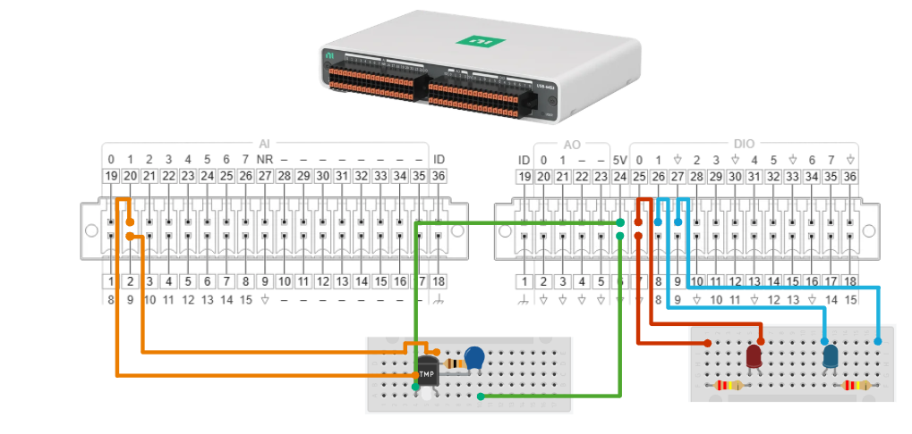

   Figure 4. Schematic of the Thermistor Circuit and LED Circuit.

Figure 5. A pinout diagram of the circuit and mioDAQ connections.

Acquisition
-----------

.. _what-is-it-4:

What is it?
^^^^^^^^^^^

Acquisition is the step where the DAQ device collects real-world signals
and converts them into digital data that the computer can use. Sensors
measure something happening in the physical world, such as temperature,
force, pressure, or motion. The DAQ then reads the electrical signal
from the sensor and turns it into a stream of numbers.

In simple terms, acquisition is how the computer “listens” to the
physical world.

Key acquisition settings
^^^^^^^^^^^^^^^^^^^^^^^^

When engineers acquire data, they need to choose settings that match the
signal they are trying to measure. Three important settings are sampling
rate, resolution, and input range.

+-----------------------------------+-----------------------------------+
| Setting                           | Why it matters                    |
+===================================+===================================+
| Sampling rate                     | - Sampling rate is how many       |
|                                   |   measurements are taken per      |
|                                   |   second.                         |
|                                   |                                   |
|                                   | - Faster-changing signals need a  |
|                                   |   higher sampling rate so         |
|                                   |   important changes are not       |
|                                   |   missed.                         |
+-----------------------------------+-----------------------------------+
| Resolution                        | - Resolution describes how small  |
|                                   |   of a change the DAQ can detect. |
|                                   |                                   |
|                                   | - Higher resolution allows the    |
|                                   |   system to distinguish smaller   |
|                                   |   changes in voltage or sensor    |
|                                   |   output.                         |
+-----------------------------------+-----------------------------------+
| Input range                       | - Input range defines the signal  |
|                                   |   levels the DAQ is expected to   |
|                                   |   measure.                        |
|                                   |                                   |
|                                   | - Choosing the right range helps  |
|                                   |   protect the device and improves |
|                                   |   measurement quality.            |
+-----------------------------------+-----------------------------------+

Why does this matter?
^^^^^^^^^^^^^^^^^^^^^

Acquisition matters because poor data collection leads to poor
decisions. If the sampling rate is too slow, the system may miss
important changes. If the range is not selected correctly, the signal
may be clipped or measured with less detail. If the resolution is too
low, small changes may be hidden.

Good acquisition settings help make data readable, useful, and reliable.

How does this apply in our project?
^^^^^^^^^^^^^^^^^^^^^^^^^^^^^^^^^^^

In the greenhouse project, the thermistor responds to changes in
temperature and produces a signal that the mioDAQ can measure. The
mioDAQ then converts that signal into digital data that can be displayed
and analyzed on the computer. This is the point in the measurement chain
where the physical world becomes data.

As you collect data, think about:

- Is the temperature increasing or decreasing?

- How quickly is it changing?

- Does the data accurately reflect what is happening in the greenhouse?

The quality of the data you collect directly impacts the decisions your
system will make later, such as whether a warning LED should turn on.

How would you do this in LabVIEW code?
^^^^^^^^^^^^^^^^^^^^^^^^^^^^^^^^^^^^^^

|image7|\ Before we get into the LabVIEW code, let’s talk about the
basic parts of LabVIEW.

Think of LabVIEW as a graphical programming language. Instead of writing
lines of text-based code, you create programs by connecting functional
blocks together.

Understanding the LabVIEW Environment
^^^^^^^^^^^^^^^^^^^^^^^^^^^^^^^^^^^^^

LabVIEW has two primary workspaces:

- Front Panel

  - The user interface of your program

  - Contains controls (inputs) and indicators (outputs)

  - This is where users interact with the application

- Block Diagram

  - The programming workspace

  - Contains functions, structures, and logic

  - This is where the code that controls the program is created

|image8|

Functions

- Perform actions such as math operations, data acquisition, timing, and
  file handling

- Similar to functions or commands in traditional programming languages

Wires

- Connect functions together

- Transfer data between different parts of the program

- The color and appearance of a wire indicate the type of data being
  passed

- |image9|\ Think of wires as the roads that carry information from one
  part of your program to another.

Useful Keyboard Shortcuts
^^^^^^^^^^^^^^^^^^^^^^^^^

+-----------+----------------------------------------------------------+
| Shortcut  | Purpose                                                  |
+===========+==========================================================+
| Ctrl + E  | Switch between Front Panel and Block Diagram             |
+-----------+----------------------------------------------------------+
| Ctrl + H  | Show Context Help window                                 |
+-----------+----------------------------------------------------------+
| Ctrl + B  | Remove broken wires from the Block Diagram               |
+-----------+----------------------------------------------------------+
| Ctrl + Z  | Undo                                                     |
+-----------+----------------------------------------------------------+
| Ctrl + S  | Save your VI                                             |
+-----------+----------------------------------------------------------+

|image10|\ Now, let’s start digging into the code! Before data can be
collected, LabVIEW must tell the mioDAQ what to measure and how to
measure it. The following code:

Figure 6. Configure the mioDAQ and prepare it to collect data.

1. Creates and configures a DAQ task.

2. Selects which channel will read the thermistor signal.

3. Sets the sampling settings, including how often data is collected.

4. Starts the task so the hardware can begin acquiring measurements.

Then in our while loop structure you will find the DAQmx Read.vi
function.

|image11|

Figure 7. Continuously read voltage measurements from the thermistor
circuit.

This part of the code:

1. DAQ Assistant/DAQmx Read continuously receives voltage measurements
   from the thermistor.

2. The While Loop repeats this process over and over, creating a live
   measurement system.

3. New sensor readings are collected each time the loop runs.

At this stage, the mioDAQ is simply measuring voltage. The system still
doesn't know the actual temperature.

So, this brings up the question, how do we analyze the data into
readable data?

How would you do this in Python code?
^^^^^^^^^^^^^^^^^^^^^^^^^^^^^^^^^^^^^

But before we analyze our data, let’s see how we can do the same
workflow in Python!

.. figure:: _static/media/image15.emf

   Figure 8. Install necessary libraries and prepare mioDAQ task.

Before the program can collect data, Python must tell the mioDAQ what
channels to use and how the measurements should be taken.

This part of the code:

- Creates three tasks:

  - One Analog Input task for measuring the thermistor voltage

  - One Digital Output task for the "Hot" LED

  - One Digital Output task for the "Cold" LED

- Selects which mioDAQ channels will be used.

- Configures the sampling rate to collect data continuously.

- Sets both LEDs to an OFF state before the program begins.

- Starts the acquisition task so measurements can begin.

Before the program can collect data, Python must tell the mioDAQ what
channels to use and how the measurements should be taken.

Now, the code tells the mioDAQ to continuously read voltage measurements
from the thermistor and ensure the data is valid before performing
calculations.

.. figure:: _static/media/image16.emf

   Figure 9.Continuously read voltage measurements from the thermistor
   in a while loop.

This part of the code:

- The program enters a While Loop that continuously runs until the user
  stops the program.

- Each iteration reads a new voltage measurement from the thermistor
  circuit.

- The measurement counter keeps track of how many readings have been
  collected.

- The voltage is checked to ensure it falls within the expected
  operating range (0 V to 5 V).

- Invalid measurements are ignored to prevent calculation errors later
  in the program.

Now that we have initialized and set up continuous sampling, we can
analyze our data to ensure that we can read the measurements.

Analysis
--------

.. _what-is-it-5:

What is it?
^^^^^^^^^^^

Analysis is the step where raw data is turned into useful information.
After the DAQ collects measurements, engineers need to inspect the data,
calculate values, identify trends, and decide what the data means.

In simple terms, analysis is how engineers turn numbers into
understanding.

Different analysis tools
^^^^^^^^^^^^^^^^^^^^^^^^

Engineers use different tools depending on the complexity of the data
and the goal of the test. Some tools are better for quick calculations,
while others are better for automation, reporting, or large test
systems.

+-----------------------------------+-----------------------------------+
| Tool                              | When it is useful                 |
+===================================+===================================+
| Excel                             | Useful for simple calculations,   |
|                                   | tables, graphs, and quick         |
|                                   | summaries.                        |
+-----------------------------------+-----------------------------------+
| LabVIEW                           | Useful for acquiring data,        |
|                                   | automating measurements, creating |
|                                   | user interfaces, and making       |
|                                   | real-time decisions.              |
+-----------------------------------+-----------------------------------+
| DIAdem                            | Useful for inspecting large data  |
|                                   | sets, creating reports, and       |
|                                   | standardizing analysis workflows. |
+-----------------------------------+-----------------------------------+
| TestStand                         | Useful for organizing test        |
|                                   | sequences, running automated test |
|                                   | steps, and managing pass/fail     |
|                                   | logic in larger systems.          |
+-----------------------------------+-----------------------------------+

.. _why-does-this-matter-1:

Why does this matter?
^^^^^^^^^^^^^^^^^^^^^

Data by itself is not enough. Engineers need to analyze data so they can
understand what happened, compare results, find patterns, and make
evidence-based decisions.

This is why data is powerful: it gives engineers a way to move from
guessing to knowing.

How does this apply to our project?
^^^^^^^^^^^^^^^^^^^^^^^^^^^^^^^^^^^

In the greenhouse project, students can analyze the temperature data
collected from the thermistor. You can look at how the temperature
changes over time, compare readings under different conditions, and
decide whether the greenhouse is too hot, too cold, or within the
desired range.

- Export the acquired data for review.

- Create a simple graph of temperature versus time.

- Calculate useful values such as minimum, maximum, average, or
  threshold crossings.

- Summarize the results in a short report.

What does this look like in LabVIEW?
^^^^^^^^^^^^^^^^^^^^^^^^^^^^^^^^^^^^

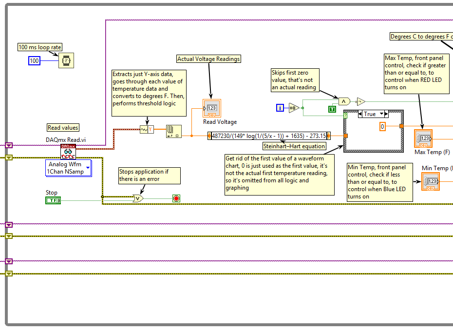

   Figure 10. Transform raw sensor data into meaningful engineering
   units.

Remember that the code only reads in voltage data. We do not know how to
conceptualize temperature as voltage measurements so, we use the
Steinhart-Hart equation to convert the voltage readings over temperature
measurements.

The code above:

- Uses the Steinhart-Hart equation to convert the thermistor's voltage
  reading into temperature.

- Applies the thermistor characteristics to calculate the actual
  temperature value.

- Converts electrical measurements into information we can understand
  and use.

Now that we can read in temperature readings, let’s start reflecting
what is going on in the greenhouse through our indicators. This is where
the system begins thinking like an engineer, using data to control the
indicators.

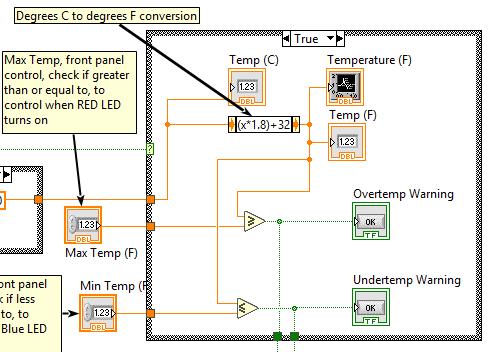

   Figure 11.Controls the indicators based on the current temperature.

.. _section-2:

.. _section-3:

.. _section-4:

.. _section-5:

.. _section-6:

.. _section-7:

.. _section-8:

.. _section-9:

.. _section-10:

.. _section-11:

.. _section-12:

This part of the code:

- A Case Structure compares the measured temperature against predefined
  conditions.

- Determines whether the greenhouse is too hot, too cold, or within the
  desired range.

- Executes different actions depending on the result.

What does this look like in Python?
^^^^^^^^^^^^^^^^^^^^^^^^^^^^^^^^^^^

.. figure:: _static/media/image18.emf

   Figure 12. Transform raw sensor data into meaningful engineering
   units aka temperature.

The data acquisition system measures voltage from the thermistor, but
voltage alone does not directly represent temperature. To convert the
electrical signal into a meaningful temperature measurement, the
software applies a thermistor conversion equation based on the sensor's
electrical characteristics.

The code above:

- Uses a thermistor conversion equation to transform the measured
  voltage into a temperature value in degrees Celsius.

- Applies the thermistor's known response curve to determine the actual
  temperature from the electrical measurement.

- Converts the calculated temperature from Celsius to Fahrenheit for
  display and analysis.

- Records temperature values and elapsed time data for trending,
  visualization, and further processing.

Now that the temperature measurements have been calculated, the
application can begin using this information to monitor environmental
conditions and update indicators, providing meaningful feedback about
what is occurring within the system.

.. figure:: _static/media/image19.emf

   Figure 13. Boolean logic for the LEDs.

This part of the code:

- Compares the measured temperature against predefined high and low
  temperature thresholds.

- Determines whether cooling or heating indicators should be activated
  based on the current temperature.

- Controls the red and blue LEDs to provide visual feedback of the
  system state.

- Updates the LED outputs only when their state changes, improving
  efficiency by avoiding unnecessary hardware writes.

- Converts the LED states into ON/OFF text and displays the voltage,
  temperature, and indicator status to the user.

|image12|\ After each of the code runs, we get a graph like the
following:

|image13|

Figure 14. Examples of Graphs after code executes in LabVIEW and Python.

We can finally take our data and make a decision!

Decision
--------

.. _what-is-it-6:

What is it?
^^^^^^^^^^^

Decision making is the final step of the measurement chain, where engineers use analyzed data to determine what action should happen next. Once we know what the data means, we can decide how the system should respond.
^^^^^^^^^^^^^^^^^^^^^^^^^^^^^^^^^^^^^^^^^^^^^^^^^^^^^^^^^^^^^^^^^^^^^^^^^^^^^^^^^^^^^^^^^^^^^^^^^^^^^^^^^^^^^^^^^^^^^^^^^^^^^^^^^^^^^^^^^^^^^^^^^^^^^^^^^^^^^^^^^^^^^^^^^^^^^^^^^^^^^^^^^^^^^^^^^^^^^^^^^^^^^^^^^^^^^^^^^

**Examples of decisions include:**
^^^^^^^^^^^^^^^^^^^^^^^^^^^^^^^^^^

Passing or failing a product during testing
^^^^^^^^^^^^^^^^^^^^^^^^^^^^^^^^^^^^^^^^^^^

Triggering an alarm or warning
^^^^^^^^^^^^^^^^^^^^^^^^^^^^^^

Adjusting a control output
^^^^^^^^^^^^^^^^^^^^^^^^^^

Turning equipment on or off
^^^^^^^^^^^^^^^^^^^^^^^^^^^

In simple terms, decision making is how data becomes action.
^^^^^^^^^^^^^^^^^^^^^^^^^^^^^^^^^^^^^^^^^^^^^^^^^^^^^^^^^^^^

.. _why-does-this-matter-2:

Why does this matter?
^^^^^^^^^^^^^^^^^^^^^

Collecting data is only useful if it helps us make better decisions. Engineers use measurements, requirements, and thresholds to determine whether a system is behaving as expected and what should happen next.
^^^^^^^^^^^^^^^^^^^^^^^^^^^^^^^^^^^^^^^^^^^^^^^^^^^^^^^^^^^^^^^^^^^^^^^^^^^^^^^^^^^^^^^^^^^^^^^^^^^^^^^^^^^^^^^^^^^^^^^^^^^^^^^^^^^^^^^^^^^^^^^^^^^^^^^^^^^^^^^^^^^^^^^^^^^^^^^^^^^^^^^^^^^^^^^^^^^^^^^^^^^^^^^^

**Good decisions depend on:**
^^^^^^^^^^^^^^^^^^^^^^^^^^^^^

Reliable measurements
^^^^^^^^^^^^^^^^^^^^^

Accurate analysis
^^^^^^^^^^^^^^^^^

Clearly defined requirements
^^^^^^^^^^^^^^^^^^^^^^^^^^^^

Without a decision, the measurement process does not lead to action.
^^^^^^^^^^^^^^^^^^^^^^^^^^^^^^^^^^^^^^^^^^^^^^^^^^^^^^^^^^^^^^^^^^^^

.. _how-does-this-apply-to-our-project-1:

How does this apply to our project?
^^^^^^^^^^^^^^^^^^^^^^^^^^^^^^^^^^^

In our greenhouse, measuring the temperature is only part of the
solution. Once we know the temperature, we need to decide whether any
action is necessary.

**For example:**

- If the greenhouse becomes **too hot**, the system may need to activate
  a cooling device, such as a fan.

- If the greenhouse becomes **too cold**, the system may need to
  activate a heating element.

- If the temperature is within the desired range, the system may not
  need to do anything at all.

In our workshop, we'll use LEDs to represent these decisions. The system
will analyze the temperature and automatically determine which LED
should turn on based on the greenhouse conditions.

This is the same process used in real-world test and automation systems:
measure the environment, analyze the data, make a decision, and take
action.

Summary
-------

Throughout this workshop, we followed the same process that test
engineers use every day to understand and interact with the world around
them.

We started with a physical phenomenon, temperature, and used a
thermistor to convert it into an electrical signal. The mioDAQ acquired
that signal, LabVIEW helped us process and visualize the data, and we
analyzed the results to understand what they meant. Finally, we used
that information to make a decision and control an output.

Together, these steps form the **measurement chain**:

**Physical Phenomenon → Sensor → DAQ → Analysis → Decision → Action**

This workflow is the foundation of countless engineering systems, from
greenhouse monitoring and industrial automation to product testing and
autonomous systems.

Looking Ahead
-------------

In the next workshop, you'll move beyond measuring and monitoring by
developing more advanced LabVIEW applications, interacting with
additional hardware, and building systems that can automatically respond
to their environment.

You'll start thinking less like someone collecting data and more like an
engineer designing complete solutions.

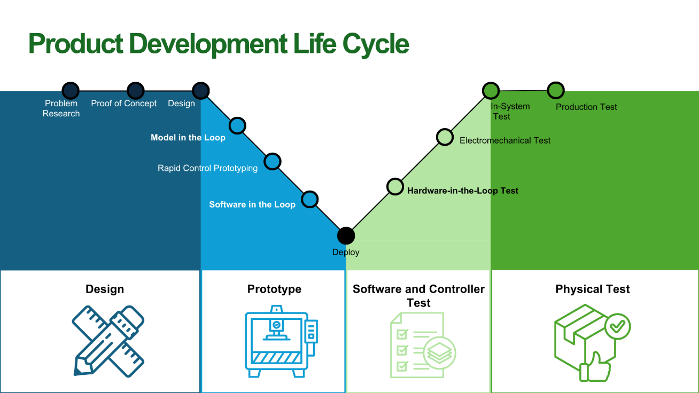
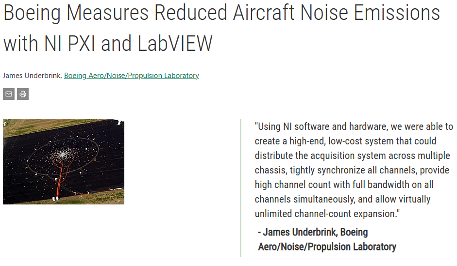
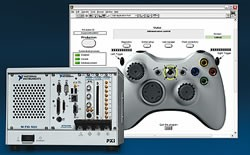

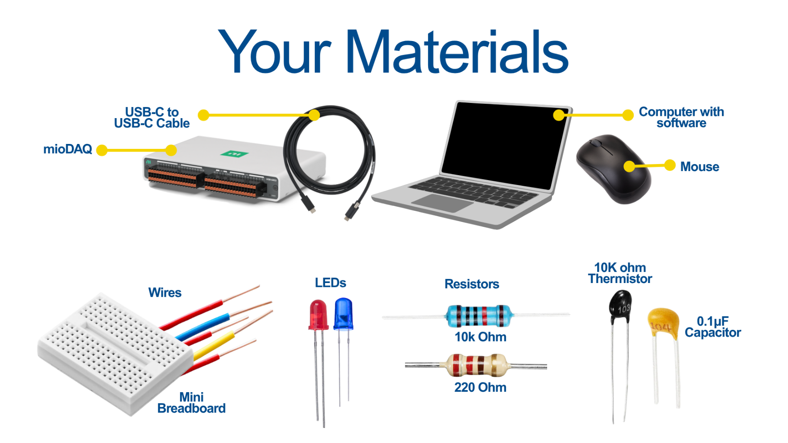
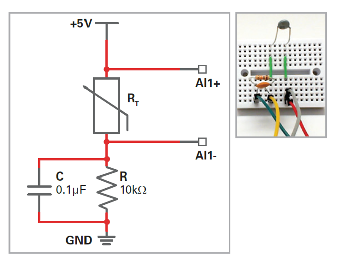
.. |LED Series Resistor Calculator \| DigiKey Electronics| image:: _static/media/image8.png
   :width: 2.38264in
   :height: 2.2875in
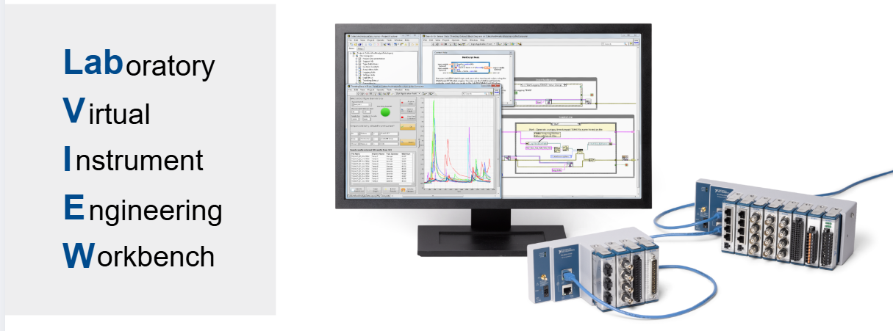
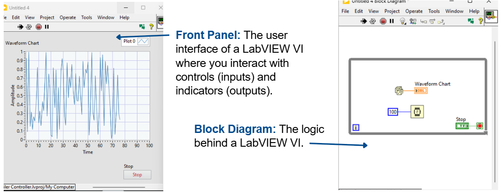
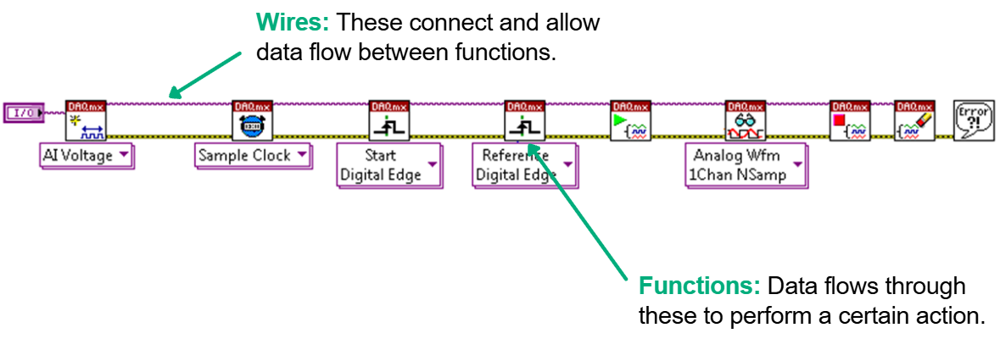
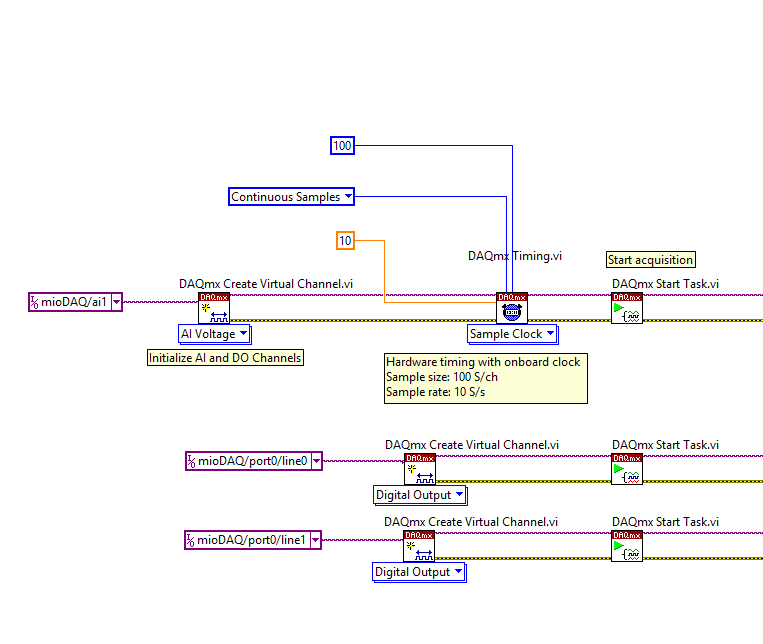

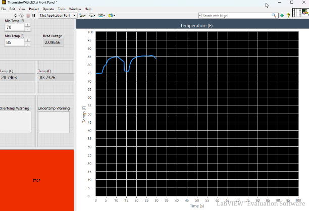
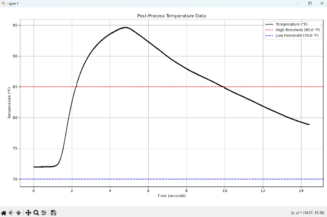
